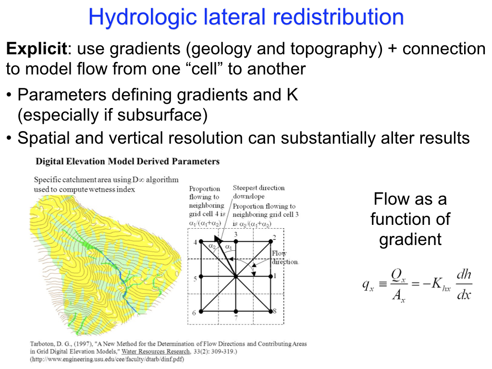

```{r begin, include=FALSE}
knitr::opts_chunk$set(echo = TRUE)
library(terra)
library(tidyverse)
#library(raster)
```

## Spatial Models

Type of spatial model influences  model approach and issues

* **Space only**
* **Space + Time**

Think about data structures needed to store states and fluxes in the model

**vector**
  location information; but not necessarily contingous; may include spatial information as input to the model
  
* country
* eco-region
    
**raster**
  area of interest is *discretized* into *patches*, and model applied to each 

Two key categories

* spatial heteogeneity only
* spatial heterogneity + connectivity 

# hydrologic connectivity example


# Sensitivity

For these models, all issues of parameter sensitivity analysis apply; 

  * more challenging as there are essentially many parmaeter and input (sensitivity to spatial relationships - e.g increasing rainfall with elevation)
  
  * spatial scale is often a critical parameter 
  Many models are sensitivity to spatial scale
  
  
  
# Getting started - a useful series of tutorials

-[** Use of Terra package for raster and verctor**](https://rspatial.org/terra/spatial/8-rastermanip.html)

### Raster Data

- [**Raster 00: Intro to Raster Data**](http://neondataskills.org/R/Introduction-to-Raster-Data-In-R/)
- [**Raster 03: Raster Calculations**](http://neondataskills.org/R/Raster-Calculations-In-R/)
- [**Raster 04: Work With Multi-Band Rasters**](http://neondataskills.org/R/Multi-Band-Rasters-In-R/)
    - sample [Landsat image](Landsat7.tif) for [NDVI](https://earthobservatory.nasa.gov/Features/MeasuringVegetation/) calculation

### Vector Data

- [**Vector 00: Open and Plot Shapefiles**](http://neondataskills.org/R/open-shapefiles-in-R/)
- [**Vector 01: Explore Shapefile Attributes**](http://neondataskills.org/R/shapefile-attributes-in-R/)
- [**Vector 04: Convert from `.csv` to a Shapefile**](http://neondataskills.org/R/csv-to-shapefile-R/)
    - sample [California gazetteer data](CA.csv) (from assignment 2)

## Displaying spatial data

- [Leaflet for R](https://rstudio.github.io/leaflet)

# R packages that help with spatial data

**terra**
**raster** older than terra but still used
**rgdal**
  essential for many spatial packages; requires installing **gdal** on your machine; can be problematic 
  
  for Mac users: I've found this site helpful
  
**terrain**
  useful analysis based on DEMs (slope/aspect etc)
  
[Install gdal]  (https://trac.osgeo.org/gdal/wiki/BuildingOnMac)


## Including Plots

You can also embed plots, for example:

```{r simple, echo=FALSE}
dem = rast("tifs/filleddem.tif")
plot(dem)
# value
summary(dem)

# spatial data (from tif)
crs(dem)

# change spatial scale
dem_coarse = aggregate(dem, fact=40, fun=mean)
crs(dem_coarse)

stream=rast("tifs/streams.tif")

# generate slope and aspect
slope = terrain(dem, v=c("slope"))
plot(slope)
aspect = terrain(dem, v=c("aspect"))
plot(aspect)

# you can combine maps together
site = c(dem, slope, aspect, stream)
plot(site)

summary(site)

# create slope classes
# a matrix with 3 columns - range (lowest, highest, newvalue)
m <- c(0, 5, 1,  6, 15, 2,  15,90, 3)
rclslope <- matrix(m, ncol=3, byrow=TRUE)
slope_class = classify(site$slope,rcl= rclslope)

summary(slope_class)
# plot 
plot(slope_class)
site$slope_class = slope_class
```

now do some modeling

```{r mod, echo=FALSE}

# make up some precipitation and temperature data
# use terrain to scale precipitation and temperature
# just an example
base_elev = 300
precip_base = 750
k = 0.003

# scale precipitation - as a function
scale_pcp = function(precip_base, elev, base_elev, k=0.003) { precip = ((elev-base_elev)*k+1)*precip_base; return(precip)}

# we can use app to run a function for all data layers
site$precip = site$filleddem %>% app(fun=scale_pcp, base_elev=base_elev, precip_base=precip_base)

plot(site$precip)

precip_base = runif(min=200, max=1000, n=4)
# now we might run over a time series of information
precip_sp  = precip_base %>% map(~scale_pcp(elev=site$filleddem, base_elev=base_elev, precip_base=.x))


# simple functions can also be applied to raster layers in stack
# imagine a simple model of slope failure vulnerability

estimate_failure_risk = function(precip,precip_thresh = 700, slope_class,soil_erodility=1) {
  
  # use precip to determine risk
  compute_precip_risk = function(precip, precip_thresh) {
    risk = ifelse(precip < precip_thresh, 0,(precip-precip_thresh)/100)
    return(risk) }
  
  base_risk = precip %>% app(compute_precip_risk, precip_thresh = precip_thresh)
  # adjust by slope class
  risk = base_risk * slope_class
  
  # adjust by soil erodibility
  risk = base_risk * soil_erodility
  
  return(risk)
  }

# try with our first precip map
risk = estimate_failure_risk(precip=site$precip, slope_class=site$slope_class)
plot(risk)

# repeat for multiple maps

risk_mprecip  = precip_sp %>% map(~estimate_failure_risk(slope_class=site$slope_class,  precip=.x))

# now this is a list 
plot(risk_mprecip[[1]])

# you can extract summary information
results = risk_mprecip %>% map(.f=summary)
results_mean = results %>% map("[","Mean")


```


